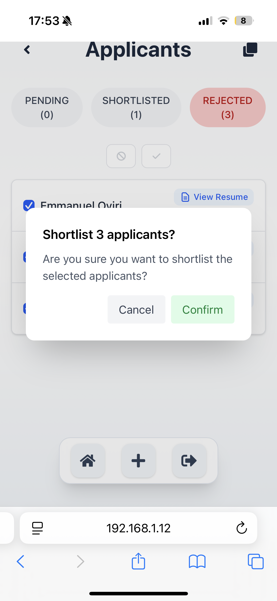

# SimplyJobs

SimplyJobs is a full-stack job search platform built using Django (backend) and React (frontend). It allows job seekers to create profiles, browse and apply for jobs, and employers to post jobs and manage applicants.

## Demo Video

Watch the full platform walkthrough: [SimplyJobs Demo](https://youtu.be/ocN684DYBaQ)

*This video showcases the user experience for both jobseekers and employers.*

## Mobile Screenshots





## Table of Contents
- [Project Focus](#project-focus)
- [Concepts & Learning Outcomes](#concepts--learning-outcomes)
- [Features](#features)
- [Technologies Used](#technolgies-used)
- [Getting Started](#getting-started)
- [Usage](#usage)
- [Running Tests](#running-tests)
- [Future Improvements](#future-improvements)

**Project Focus:**  
When building SimplyJobs, I focused on the experience of the end user. For job seekers the main goal was to make the job application process easier, more engaging, and quicker. The platform streamlines profile setup, resume uploads, and job browsing, so users can apply to jobs with ease. For employers, SimplyJobs is designed to simplify job posting and make managing applicants fast and intuitive, helping them efficiently find and shortlist the best candidates.

**Note:** This project is still under devolpement and additional features will be added in future versions.

## Concepts & Learning Outcomes

This project demonstrates several key software engineering concepts:

- **Authentication & Authorization:**  
  Uses JWT for secure user authentication and role-based access (job seeker vs employer).

- **RESTful API Design:**  
  Backend exposes clean REST endpoints for all major resources (users, jobs, applications, profiles).

- **Frontend-Backend Integration:**  
  React communicates with Django REST API using async requests and token-based authentication.

- **CRUD Operations:**  
  Implements Create, Read, Update, and Delete for users, profiles, jobs, applications, education, and experience via RESTful APIs and the frontend UI.

- **State Management:**  
  React hooks (`useState`, `useEffect`) manage UI state, form data, and API responses.

- **File Uploads:**  
  Users can upload resumes and profile pictures, with backend validation for file type and size.

- **Relational Data Modeling:**  
  Django models use relationships (OneToOne, ForeignKey) to connect users, profiles, jobs, applications, education, and experience.

- **Testing:**  
  Includes unit tests for models and API endpoints to ensure reliability.

- **Responsive Design:**  
  Uses Tailwind CSS for a modern, mobile-friendly UI.

- **Permissions & Security:**  
  Custom permissions restrict access to sensitive actions (e.g., only employers can post jobs).

## Features

- User authentication (JWT)
- Separate dashboards for job seekers and employers
- Profile creation and editing
- Resume upload and profile picture support
- Education and experience management
- Job posting and management for employers
- Applicant sorting and filtering by status (pending, shortlisted, rejected)
- Job application status tracking for job seekers
- Responsive UI

## Technologies Used

- **Backend:** Django, Django REST Framework, Simple JWT
- **Frontend:** React, Tailwind CSS
- **Database:** SQLite (default for local development; easily configurable to PostgreSQL or MySQL for production)

## Getting Started

### Backend

1. Install dependencies:
    ```sh
    pip install -r requirements.txt
    ```
2. Run migrations:
    ```sh
    python manage.py migrate
    ```
3. Start the server:
    ```sh
    python manage.py runserver
    ```

### Frontend

1. Install dependencies:
    ```sh
    npm install
    ```
2. Start the development server:
    ```sh
    npm run dev
    ```

## Usage

- Register as a job seeker or employer.
- Job seekers create and edit their profile, upload a resume, apply for jobs and track the status of their applications.
- Employers can post jobs and view/manage applicants.

## Running Tests

Backend:
```sh
python manage.py test
```

## Future Improvements

Planned features for future versions of SimplyJobs include:

- **Advanced Filtering:**  
  Allow job seekers and employers to filter jobs and applicants by job type, location, skills, and more.

- **Location Selection:**  
  Integrate a location API to enable users to select their location, improving the accuracy and usefulness of location-based filtering.

- **Notifications:**  
  Add a notifications tab for both job seekers and employers to keep users updated on application status, new jobs, and new applicants.

- **Bookmarking Jobs:**  
  Enable job seekers to bookmark jobs they are interested in and apply later.

- **UI Enhancements:**  
  Implement additional UI features and minor improvements for a smoother and more engaging user experience.

- **Monetization:**  
  When fully developed, I plan to monetize SimplyJobs by offering premium job posting options for employers. Pricing would be based on the duration a job listing remains active and could include additional features such as increased visibility or highlighted postings. This approach will help manage quality of jobs and provide value to employers while keeping basic postings
